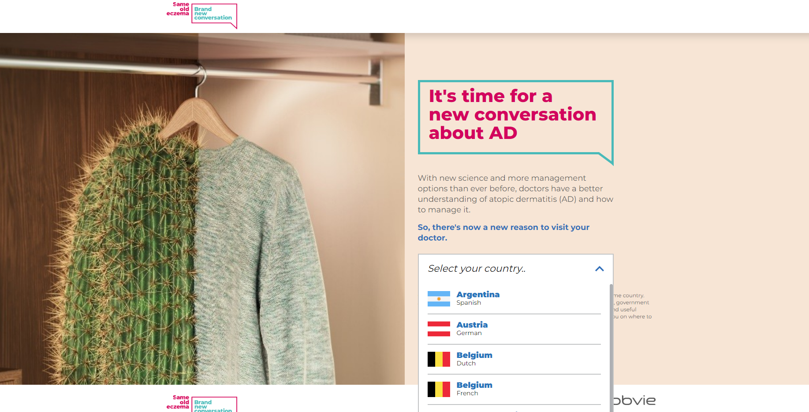

# Professional-Projects-Database

# **AbbVie Care**

_Project Background:_  The AbbVie Care platform aims to engage with patients by providing them and their immediate surrounding non-promotional and referenced information on diseases and adapted way of life. This patient engagement platform will contain scientifically sourced articles, videos with patient testimonials, advices from HCPs, and other tools aiming at improving the patients’ quality of life. By providing patients and their surrounding with high quality information and tools, this digital engagement platform will hopefully deliver value in relieving the burden of diseases.

_Technology Used:_ AEM, AngularJS, Java, Javascript, HTL, Sling, JCR, Maven etc.

_Project URL:_ [https://www.abbviecare.fr/](https://www.abbviecare.fr/)

_Role:_ Lead Test Engineer

# **AD Patient Activation**

_Project Background:_  AD Patient Activation aims to fill an important need for patients suffering from Atopic Dermatitis (AD), who often feel that they must undergo a prescribed treatment plan without question or complaint—even if it means powering through their symptoms. Despite the significant improvements made in the treatment of AD, many patients are still not achieving remission—or talking about their treatment goals with their HCPs. It aims to liberate all the energy pent up within patients and providers and channel it into constructive conversation.

_Technology Used:_ AEM, AngularJS, Java, Javascript, HTL, Sling, JCR, Maven etc.

_Project URL:_ [https://www.lets-talk-eczema.com/](https://www.lets-talk-eczema.com/)

_Role:_ Lead Test Engineer

# **Project: Tale of Two Patient**

_Project Background:_  The website provides a digital experience which illustrate the journey of two psoriasis patients from diagnosis through working with their doctor  to develop a management plan.

_Technology Used:_ AEM, AngularJS, Java, Javascript, HTL, Sling, JCR, Maven, etc.

_Project URL:_ [https://www.let-me-be-clear.com/](https://www.let-me-be-clear.com/pl/pl-pl.html)

_Role:_ Lead Test Engineer

# **Project: TALK OVER RA**

_Project Background:_ TALK OVER RA aims to fill an important need for patients suffering from rheumatoid arthritis (RA), who often feel that they must undergo a prescribed treatment plan without question or complaint—even if it means powering through their symptoms. Despite the significant improvements made in the treatment of RA, many patients are still not achieving remission—or talking about their treatment goals with their rheumatologist. The TALK OVER RA campaign was developed not just to address that dynamic, but to disrupt it and turn it on its head. It aims to liberate all the energy pent up within patients and providers and channel it into constructive conversation. 

_Technology Used:_ AEM, AngularJS, Java, Javascript, HTL, Sling, JCR, Maven, etc.

_Project URL:_ [https://www.talkoverra.com/au/en.html](https://www.talkoverra.com/au/en.html)

_Role:_ Test Engineer

                                     Copyright © Noor Ismot Ara- All rights reserved
